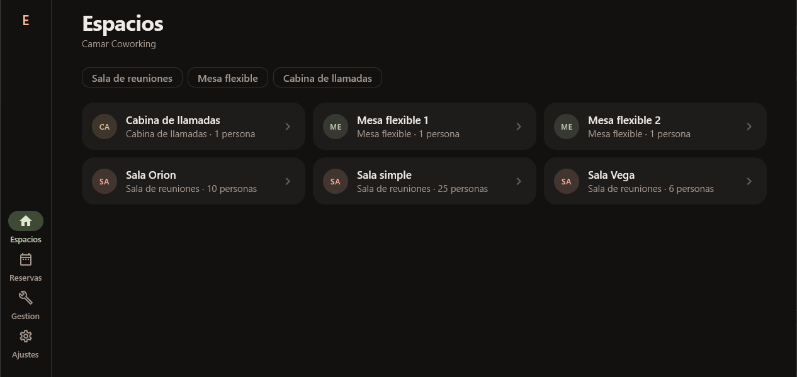
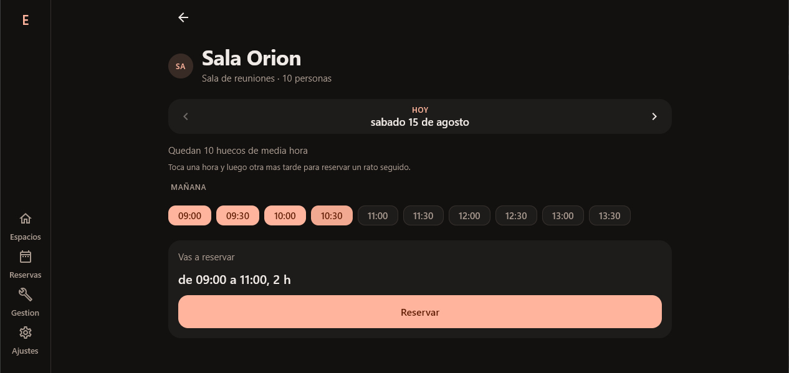
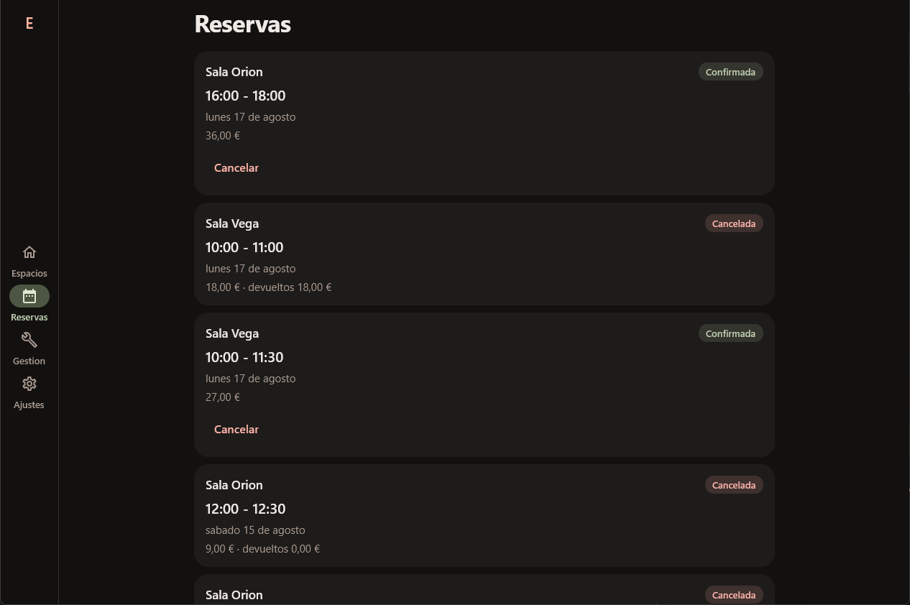
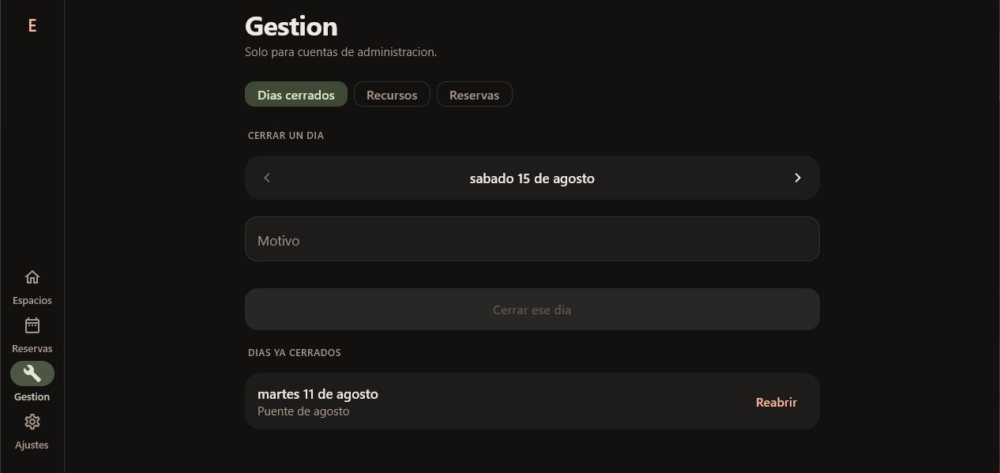
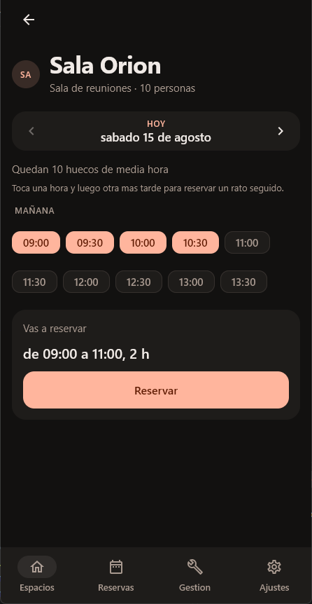
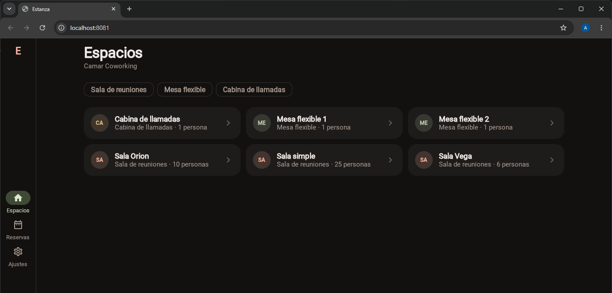

# Estanza

Cliente del coworking [Camar](https://github.com/MendietaGarciaAlejandro/Camar). Corre en
Android, en escritorio y en el navegador, y el código de las pantallas es el mismo en los tres
sitios.

Lo hice para tener un cliente de verdad contra una API que ya conocía por dentro, y para usar
en algo real la librería de validadores que había publicado antes. Lo interesante no acabó
siendo Compose Multiplatform —que funciona mejor de lo que esperaba— sino lo que aparece
cuando un cliente y un servidor escritos por la misma persona tienen que ponerse de acuerdo en
cosas que nadie había escrito en ningún sitio.

## Cómo se ve



El catálogo del coworking, con el filtro por tipo. La rejilla se reparte según lo que quepa:
aquí tres columnas, en una ventana estrecha una.



Tocas una hora y luego otra más tarde, y se selecciona el rango entero. De uno en uno no
serviría: una mesa flexible tiene un mínimo de cuatro horas en las reglas de Camar.



Lo reservado y lo cancelado, con lo que se devolvió de cada cancelación. La penalización la
calcula el servidor según cuánta antelación había.



Solo con una cuenta de administración: cerrar días sueltos, dar de alta recursos y ver las
reservas de todo el coworking. El apartado se pinta si el rol del token lo es, pero quien
guarda la puerta es Camar.



La misma aplicación midiendo el ancho: por debajo de 700 dp la navegación baja a una barra, que
es donde llega el pulgar.



Y compilada a WebAssembly. Mismo código, sin una línea aparte.

## Stack

- Kotlin 2.4.10 y Compose Multiplatform 1.11.1
- Targets: `androidTarget`, `jvm` (escritorio) y `wasmJs` (navegador)
- Ktor 3.5.2 para HTTP, con un motor distinto por plataforma
- Koin 4.2.2 para inyección de dependencias, y multiplatform-settings para las preferencias
- [validadores-es](https://github.com/MendietaGarciaAlejandro/validadores-es), mi propia
  librería, para NIF, NIE, CIF, IBAN, teléfono y código postal

## Cómo levantarlo

Necesita un Camar corriendo. Por defecto apunta a `http://localhost:5106`, salvo en Android,
donde apunta a `http://10.0.2.2:5106` porque es así como el emulador ve el localhost del PC.
Con un móvil de verdad hay que cambiarlo, y para eso está la pantalla de ajustes.

```bash
./gradlew :composeApp:run                              # escritorio
./gradlew :composeApp:assembleDebug                    # APK de Android
./gradlew :composeApp:wasmJsBrowserDevelopmentRun      # navegador
./gradlew :composeApp:jvmTest                          # tests
```

En escritorio hay que usar `run` y no la recarga en caliente de Compose 1.11: esa va por
`hotRunJvm` y exige un JetBrains Runtime 21, y el JBR que trae Android Studio es más nuevo.

Para la versión web, el servidor de desarrollo abre en el 8080 o en el 8081 según cuál esté
libre, y **Camar tiene que permitir ese origen** en `Cors:OrigenesPermitidos`. Si no, el
navegador bloquea las peticiones y en consola no se ve gran cosa. Es el fallo más tonto y el
que más rato me costó la primera vez.

Los 87 tests están en `commonTest`, así que valen para los tres targets; cubren los modelos de
pantalla, el cliente HTTP y el formateo. `jvmTest` es lo más rápido para ejecutarlos.

## Decisiones

### Koin, no Hilt

En Ocrea usé Hilt y estoy contento con él, pero aquí no vale: genera el código con un
procesador de anotaciones que solo entiende de Android. Koin resuelve en tiempo de ejecución y
por eso funciona igual en los tres targets, a cambio de que un error de cableado salte al
arrancar y no al compilar.

### La dirección del servidor se cambia desde la propia aplicación

Camar no está desplegado en ningún sitio fijo, así que la IP cambia cada dos por tres y
dejarla escrita obligaba a recompilar las tres versiones. Ahora se guarda como preferencia,
cada plataforma tiene su valor por defecto, y hay un botón que manda una petición de verdad
para ver si al otro lado hay alguien.

Ese botón trata un 401 como éxito, y es a propósito: significa que el servidor está ahí y ha
entendido la petición, solo que todavía no hay sesión. Es justo lo que quieres saber cuando
estás configurando la dirección y aún no tienes credenciales.

### Las horas de Camar se leen en UTC

La que más me hizo pensar. Camar manda los huecos con desfase `+00:00`, pero lo que quiere
decir es *hora local del coworking*: la apertura de las ocho llega como `08:00:00+00:00`. Es
una simplificación documentada en el propio servidor.

Lo natural habría sido parsear a `Instant` y convertir a la zona del dispositivo. En agosto en
España eso corre las horas dos posiciones y el coworking parece abrir a las diez y cerrar a las
once de la noche. Así que se leen en UTC, y esa decisión vive en un único fichero con el porqué
al lado. El día que Camar mande instantes de verdad, se cambia ahí y ya.

### El dinero nunca es un `Double`

Un precio no es una medida aproximada: acaba en una factura, y en coma flotante 0.1 + 0.2 no
da 0.3. En `commonMain` no hay `BigDecimal`, así que escribí un serializador que conserva el
texto literal del JSON y lo paso a céntimos con enteros solo para pintarlo.

Esto resolvió de paso algo que descubrí comparando respuestas: Camar manda el mismo precio con
dos decimales al listar (`18.00`) y con tres al crear (`18.000`).

### Los mensajes del servidor no se reescriben

Camar contesta con ProblemDetails y sus mensajes ya están redactados para leerse: *"Ese hueco
ya esta reservado."*. La aplicación los enseña tal cual.

La tentación era adelantarse comprobando las reglas en el cliente, pero esas reglas son del
servidor y pueden cambiar sin que el cliente se entere: acabarías enseñando una condición que
ya no es cierta. Lo único que sí se comprueba antes de salir a la red son los documentos y las
cuentas bancarias, y eso es distinto: el algoritmo del NIF no va a cambiar nunca.

Ahí es donde entra **validadores-es**. Un DNI con la letra cambiada se caza sin gastar una
petición, y los ocho campos del alta se señalan todos a la vez en vez de de uno en uno. El
servidor valida lo mismo por su cuenta, y esa es la validación que cuenta.

Un detalle que no esperaba: Android resuelve `validadores-es-jvm`. La librería solo publica
targets `jvm` y `wasmJs`, pero la regla de compatibilidad de Kotlin deja que `androidJvm`
consuma variantes `jvm`, así que funciona en Android sin tener un target de Android.

### Dos grafos de navegación, no uno

Uno para cuando no hay sesión y otro para cuando la hay, y lo que decide cuál se ve es el
`StateFlow` del almacén de sesión. Con un grafo único y `popUpTo` habría que acordarse de
limpiar la pila al entrar, al salir y además cuando el token caduca solo.

### La interfaz se coloca según el sitio que haya

Un armazón mide el ancho disponible: por debajo de 700 dp barra abajo, por encima rail a la
izquierda. Lo mide un `BoxWithConstraints` y no las clases de tamaño de ventana de Material,
que para multiplataforma todavía van por versiones alpha.

Cerrar sesión se fue a ajustes en vez de quedarse en la barra: es una acción de una vez cada
mucho, y tenerla siempre a un toque solo servía para pulsarla sin querer.

El estilo tampoco es el de Material por defecto —paleta terracota y oliva, listas agrupadas en
vez de una tarjeta por elemento—, pero no se empaqueta ninguna fuente: se usa la del sistema,
porque una tipografía propia engorda la descarga de la versión web y no compensaba.

## Lo que solo se ve probándolo

Levanté Camar y comparé lo que asumían mis tests con lo que contesta de verdad. Tres cosas
salieron de ahí: los errores no vienen como `application/json` sino como
`application/problem+json`, y si no lo registras aparte en `ContentNegotiation` el cuerpo del
error se pierde entero; el 401 de un endpoint protegido sin token no trae cuerpo ninguno,
porque lo emite el middleware de JWT y no el manejador de excepciones; y `expiresAt` llega con
siete decimales de segundo, que es como los escribe .NET.

Escribiendo los tests salieron otras cuatro, y cada arreglo destapaba el siguiente. El
dispatcher de `Main` y el de `runTest` tenían planificadores distintos. Aun compartiéndolo
seguía sin funcionar: el motor de Ktor resuelve en `Dispatchers.Default`, en hilos de verdad, y
adelantar el tiempo *virtual* no espera a hilos reales. Al poner `withTimeout` para no
colgarme, saltaba siempre, porque dentro de `runTest` los timeouts también van con tiempo
virtual. Y la que más me costó ver: **esperar a que un indicador de "cargando" se apague es una
carrera**; si la respuesta llega antes de que el test se suscriba al flujo, la espera no ve
nunca el cambio.

Y el rediseño de la interfaz dejó tres más. Nadie pintaba el fondo, así que con el sistema en
oscuro salía el tema oscuro dibujado encima del blanco del HTML. `fillMaxWidth().widthIn(max =
460.dp)` no recorta nada, porque `fillMaxWidth` deja fijada la anchura y el `widthIn` de detrás
ya no puede con un mínimo que vale lo mismo que el máximo: va al revés. Y los modelos de las
pestañas sobreviven entre visitas por el `saveState`, así que hacías una reserva, volvías y la
pantalla seguía diciendo que no habías reservado nada.

Ese último lo encontré usando la aplicación, no con los tests, y es el que más me gusta de los
tres: es el tipo de fallo que aparece cuando cambias la forma de navegar y no repasas quién
sobrevive a qué.

## Limitaciones conocidas

- **El token se guarda sin cifrar**, en las mismas preferencias que la dirección del servidor.
  Con un token de vida corta y sin refresco es asumible aquí, pero en algo real el de Android
  tendría que ir a EncryptedSharedPreferences.
- **No funciona sin conexión.** El catálogo se guarda en memoria mientras la aplicación está
  abierta y se olvida al cerrarla.
- **La lista de huecos vacía no distingue "cerrado" de "completo".** Camar contesta lo mismo en
  los dos casos, y prefiero decir lo que sé a adivinarlo repitiendo aquí el horario.
- **La administración no enseña nombres de socio**, porque Camar devuelve el id del usuario en
  las reservas pero no su nombre. Se arreglaría en el servidor, no aquí.
- **La versión web pesa mucho**: unos 13,5 MB ya optimizada, de los que 8,3 son Skiko, el motor
  gráfico de Compose. No tiene arreglo por mi parte, y es el punto flojo de Compose en el
  navegador.
- **No hay tests de interfaz.** Los dos fallos de disposición del rediseño no los habría cazado
  ninguno de los 87 que hay.
- **No hay target de iOS.** Compose Multiplatform lo soporta, pero no tengo Mac.
- **Solo habla español.** El formateo de fechas está escrito a mano porque el formateo por
  locale no funciona igual en las tres plataformas.

## Los tres proyectos

Este es el tercero de una serie que encaja:

- **[Camar](https://github.com/MendietaGarciaAlejandro/Camar)** — la API, en .NET
- **[validadores-es](https://github.com/MendietaGarciaAlejandro/validadores-es)** — la librería
  de validadores españoles, publicada en Maven Central
- **Estanza** — este cliente, que usa las dos
